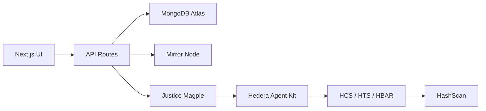

# The Hedera Court

Justice Magpie has reviewed another tiny civic disaster and, against all reasonable expectations, placed it on Hedera Testnet. The Hedera Court is a funny two-player courtroom where petty complaints become wallet-signed testnet receipts, public HCS docket entries, verdict NFTs, and one exhausted British ruling.

## Demo Video

X demo video: `TODO: add public demo video link`

## Live App

Vercel deployment: `TODO: add deployed app link`

## Public GitHub

Public repository: `TODO: add GitHub repo URL`

## What The App Does

A plaintiff connects HashPack, files a 280-character complaint, and signs a symbolic 0.5 testnet HBAR transfer to the court treasury. The app verifies the payment through the Hedera Mirror Node, creates a MongoDB case, submits a `CASE_FILED` message to Hedera Consensus Service, and returns a summon link.

The defendant opens the link, connects a different wallet, pays the same symbolic testnet ante, and pleads. Justice Magpie rules, the server mints verdict NFTs, sends a 0.95 testnet HBAR payout to the winner, keeps a symbolic 0.05 testnet HBAR court fee in the treasury, and publishes the verdict to HCS.

## Why It Is Fun

The joke is simple: the dispute is petty, but the receipts are serious. The UI feels like a shabby English law library with Wi-Fi, and the AI judge treats TypeScript arguments, startup habits, and social nonsense like constitutional emergencies.

## Hedera Agent Kit

The server includes Hedera Agent Kit JS in the autonomous ruling pipeline. The pipeline initializes the Agent Kit tool surface in `AgentMode.AUTONOMOUS` before server-side Hedera actions, while deterministic SDK transactions are used for exact transaction IDs and resumable state updates. This keeps the human-in-the-loop boundary clear: users approve their own wallet transfers, and the server performs limited court actions with audit links.

Each case stores a public Agent Kit trace for the autonomous court actions: HCS case filing, HCS defense filing, HTS verdict NFT mints, HBAR winner payout, and HCS verdict publication. The verdict page and public docket show the trace beside the HashScan receipts so reviewers can see the Agent Kit path during the demo.

Relevant files:

- `lib/hedera/agent.ts`
- `lib/hedera/docket.ts`
- `lib/hedera/nft.ts`
- `lib/court/ruling-pipeline.ts`

## Hedera Services Used

- HBAR transfers: plaintiff ante, defendant ante, winner payout
- HTS NFTs: Acquitted and Sentenced verdict NFTs
- HCS public docket: `CASE_FILED`, `DEFENSE_FILED`, and `VERDICT` messages
- Mirror Node: payment verification and replay resistance
- HashScan: transaction, topic, and token links

## HashScan Examples

Replace after the live demo run:

- Case filed HCS transaction: `TODO`
- Defense filed HCS transaction: `TODO`
- Verdict HCS transaction: `TODO`
- Verdict token: `TODO`
- Winner payout transaction: `TODO`
- Docket topic: `TODO`

## Architecture



## Local Setup

```bash
npm install
cp .env.example .env.local
npm run dev
```

Open `http://localhost:3000`.

Before opening a pull request or deploying:

```bash
npm run verify
```

## Environment Variables

Use `.env.example` as the source of truth. Private keys stay server-side.

```env
HEDERA_NETWORK=testnet
HEDERA_OPERATOR_ID=
HEDERA_OPERATOR_KEY=
HEDERA_COURT_TREASURY_ID=
HEDERA_VERDICT_TOKEN_ID=
HEDERA_DOCKET_TOPIC_ID=
MONGODB_URI=
AI_PROVIDER=gemini
AI_MODEL=gemini-2.5-flash-lite
GEMINI_API_KEY=
GROQ_API_KEY=
GROQ_MODEL=llama-3.1-8b-instant
ANTHROPIC_API_KEY=
ANTHROPIC_MODEL=claude-sonnet-4-5
OPENAI_API_KEY=
OPENAI_MODEL=gpt-5.4-nano
OPENAI_IMAGE_MODEL=gpt-image-1-mini
NEXT_PUBLIC_APP_URL=http://localhost:3000
NEXT_PUBLIC_HEDERA_NETWORK=testnet
NEXT_PUBLIC_WALLETCONNECT_PROJECT_ID=
HEDERA_ALLOW_MOCK=false
```

## Cheap Model Setup

`AI_PROVIDER=gemini` with `AI_MODEL=gemini-2.5-flash-lite` is the recommended low-cost setup for bounty demos. The app also supports `groq`, `anthropic`, `openai`, `openrouter`, and `openai-compatible` providers through environment variables.

Image generation is optional. The repo includes checked-in assets and SVG fallbacks, so `OPENAI_API_KEY` can stay empty unless you want to regenerate the artwork.

## Bootstrap

Create the HCS topic and HTS NFT collection:

```bash
npm run bootstrap
```

The script writes:

```txt
.env.local.generated
```

Copy the printed `HEDERA_VERDICT_TOKEN_ID` and `HEDERA_DOCKET_TOPIC_ID` into `.env.local`. The script does not overwrite `.env.local`.

For the demo, use three separate Hedera testnet accounts:

- Court operator/treasury: server-side only
- Plaintiff wallet: signs the complaint ante
- Defendant wallet: signs the defense ante

Do not use the court treasury wallet as either player wallet, because the app verifies that the player account actually paid the court ante.

## Deploying To Vercel

See [`DEPLOYMENT.md`](./DEPLOYMENT.md) for the full deployment checklist.

Short version:

1. Push the repository to GitHub.
2. Import it into Vercel with the `Next.js` preset.
3. Set Node.js to `20.x`.
4. Add all variables from `.env.example` in Vercel Project Settings.
5. Set `NEXT_PUBLIC_APP_URL` to your production Vercel URL.
6. Deploy.

## MongoDB Atlas

1. Create a free MongoDB Atlas cluster.
2. Create a database user.
3. Add your current IP address to network access.
4. Copy the connection string into `MONGODB_URI`.
5. The app creates `cases` and `counters` collections automatically through Mongoose.

## Demo Script

See `docs/demo-script.md`.

## Safety Notes

- Testnet only.
- No real money.
- No mainnet configuration path.
- Users explicitly approve their own HashPack transfers.
- The server does not autonomously move funds from user wallets.
- The court operator key stays server-side.
- `HEDERA_ALLOW_MOCK=false` for bounty demos.

## Known Limitations

- NFT mints are stored on the configured verdict collection; wallet-side NFT association is intentionally avoided for the 60-second demo.
- The Agent Kit wrapper is kept narrow so transaction IDs stay deterministic for HashScan.
- Vercel serverless execution may require a longer function timeout if Anthropic or Hedera Testnet are slow.

## Future Improvements

- Add optional NFT transfers for users who opt into token association.
- Add a replay view reconstructed directly from HCS Mirror Node messages.
- Add more Justice Magpie fallback templates for offline demos.
- Add a one-click clerk page for resuming stuck cases.

## Bounty Feedback

The Hedera Agent Kit would benefit from a complete human-in-the-loop demo that combines wallet-signed user payments, server-side autonomous agent actions, HCS messages, HTS NFT minting, and HashScan links in one small reference app.

For bounty builders, the hardest part is not calling one tool. The hard part is designing a safe flow where the user explicitly approves their own transaction, then the agent performs limited server-side actions with clear auditability.

A reference example for this pattern would help developers build fun commercial or social agents without accidentally creating unsafe autonomous fund movement.

## License

MIT
